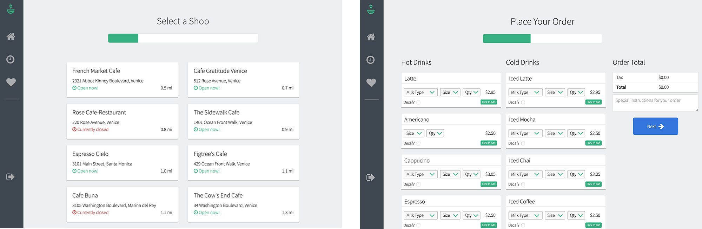
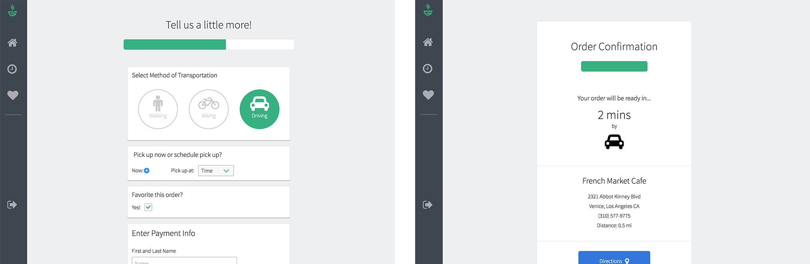
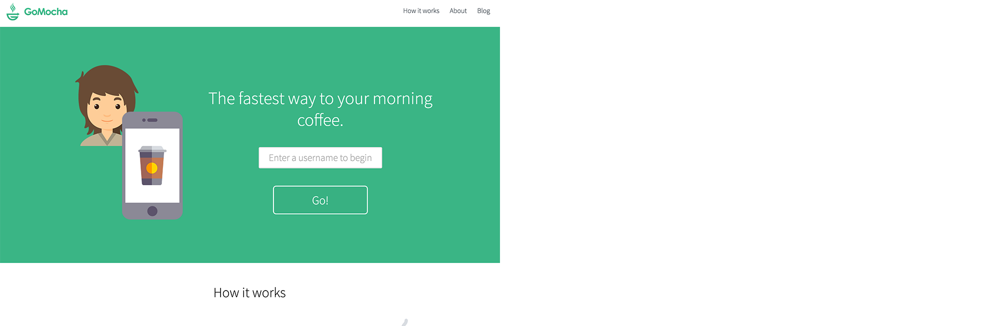

# GoMocha
GoMocha is a geolocation food and drink ordering application that calculates how long it will take the customer to arrive at the coffee shop for seamless mobile and web ordering.

<a href="http://gomocha.herokuapp.com/" target="_blank">Click here</a> for a demo.
  

  
## Overview
The user story is as follows: A customer logs on to the app, selects a coffee shop in their area, creates their order, selects their method of transportation, and submits their order. The coffee shop is then notified of the order and receives the customer's estimated time of arrival based on their selected method of transportation. The customer then heads to the shop, and the order is ready when they arrive. All payment is handled through the app, to give an end to end seamless transaction.

## Technical
• The front end of the app is built in React, using SASS as a CSS extension language, and webpack as a module bundler. 
• The back end is built in Node.js using Express, and uses MongoDB as a database. 
• The app uses the Google Maps API and HTML Geolocation API in order as follows: 
   1. Once the user opens the app, navigator.geolocation.getCurrentPosition() is called to retrieve the users latitude and longitude coordinates. 
   2. As soon as the user's location is retrieved, a call is made to the Google Maps API while passing in the user's latitude and longitude coordinates as an argument, to retrieve a list of restaurants with the tag "cafe" that are within 4,000 meters of the user's location. A list of coffee shops is then generated for the user to choose from. 
   3. As soon as a user clicks on their desired coffee shop, another API call is made to the Google Maps API while passing in the coffee shop's unique google ID, to retrieve more information about the coffee shop (specifically the shop's coordinates). 
   4. A final call to the Google Maps API is called upon the user selecting their method of transportation. This call passes in the user's coordinates, the shop's coordinates, and the selected method of transportation to estimate the time it will take for the customer to arrive at the coffee shop. 

• Submitted orders are sent to the database along with the user's username, to allow the display of previous and favorited orders. 
• Travis CI is used for distributed continuous integration
  

  
## Development Roadmap
Future developments of the app will include: 
• A business admin (BA) interface to receive all orders submitted by customers, to be handled by the coffee shop. BA interface will provide customer management and sales statistic tools  
• Social login 
• Ability to search for shops 
• Ability to start new order from previous and favorited orders 
• Ability to share submitted order on Facebook 
• Credit card authorization 
  

